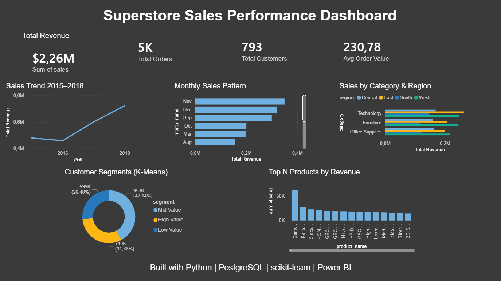

# Superstore Sales Performance Analysis

An end-to-end data analytics project analyzing 9,800 US retail 
transactions to uncover revenue drivers, customer behavior, 
and growth opportunities.



## 🔍 Key Findings

- Total revenue grew **57%** from $479K (2016) to $722K (2018)
- **Q4 (Nov–Dec)** is the strongest sales period — driven by 
  US holiday shopping season
- **Technology** is the top category across all 4 regions
- **West region** leads with $710K, South underperforms at $389K
- Top 10% of customers (High Value) generate **5x more revenue** 
  than low value customers
- Canon imageCLASS 2200 Copier is the #1 product at **$61K revenue**

## 🛠️ Tech Stack

- **Python** — Pandas, NumPy, Matplotlib, Seaborn, scikit-learn
- **PostgreSQL** — Advanced SQL queries, CTEs, Window Functions
- **Power BI** — Interactive dashboard
- **Jupyter Notebook** — Analysis environment

## 📁 Project Structure

```
superstore-analysis/
├── data/
│   ├── train.csv
│   └── customer_segments.csv
├── sql/
│   └── queries.sql
├── superstore_analysis.ipynb
├── superstore_dashboard.pbix
└── README.md
```

## 📊 Analysis Phases

1. **Data Cleaning** — handled missing values, fixed data types, 
   standardised column names
2. **EDA** — answered 8 business questions with charts and insights
3. **SQL Analysis** — 6 queries including CTEs and window functions
4. **Customer Segmentation** — K-Means clustering (3 segments)
5. **Power BI Dashboard** — interactive visualizations

## 🚀 How to Run

1. Clone the repository
2. Install requirements:
    pip install pandas numpy matplotlib seaborn scikit-learn sqlalchemy psycopg2-binary
3. Open `superstore_analysis.ipynb` in Jupyter/VS Code
4. Run all cells top to bottom

## 👩‍💻 Author

**Dhilna Kurisingal Mathew**  
Master's in Data Science — Philipps-Universität Marburg  
[LinkedIn](https://www.linkedin.com/in/dhilna-k-m-6a99801a1) | 
[GitHub](https://github.com/Kurising)